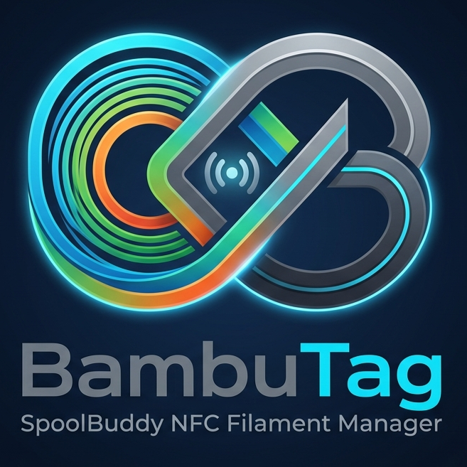
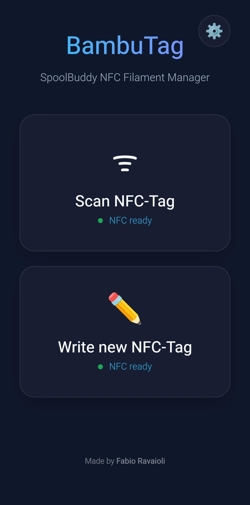
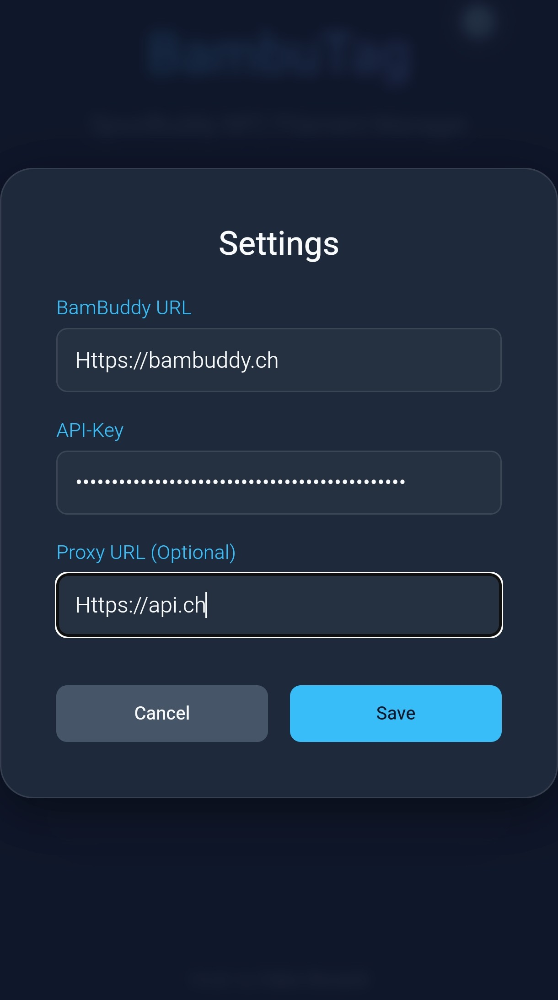
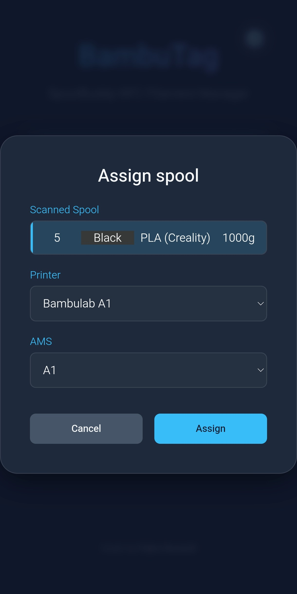
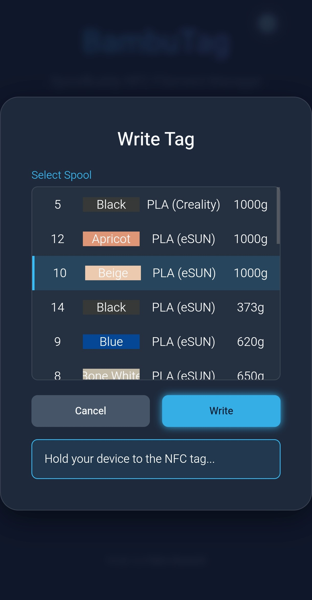

<div align="center">
  
</div>

**BambuTag** is a modern, lightweight Progressive Web App (PWA) that turns your smartphone into a handy NFC scanner. With this application, you can easily expand **BamBuddy** (Spoolman) to scan or write NFC tags for filament spools directly using your mobile device, allowing you to assign them to printer AMS slots without needing a PC.

---

## 🚀 Features

- **In-Browser NFC Support:** Utilize your smartphone or NFC-capable device to scan or write NFC tags directly.
- **Seamless BamBuddy Integration:** Retrieve spool inventory data, colors, materials, and remaining weights directly from your Spoolman database.
- **Direct Assignment:** Assign scanned spools directly to your printers and AMS slots in BamBuddy.
- **Easy Configuration:** Settings for your server URL, API key, and optional proxies are stored directly within the user interface.
- **PWA:** Once loaded, the web app can be installed on your device's home screen for easy mobile use.

---

## ⚠️ Important Security Notice

Because this application does not use server-side authentication and stores your API keys locally in your browser (`localStorage`), it is highly recommended to run this application **only within your local network (LAN)** and not expose it to the public internet.

---

## 🌐 CORS (Cross-Origin Resource Sharing) Notice

If your BambuTag and BamBuddy instances are not hosted under the exact same domain, modern browsers will block the API requests with a CORS error. In this case, you will need to set up an API Proxy. 

**Recommended Proxy:** [`testcab/cors-anywhere:latest`]([https://hub.docker.com/r/testcab/cors-anywhere](https://hub.docker.com/r/testcab/cors-anywhere)).

---

## 🔒 HTTPS and NFC Requirements

To use the in-browser NFC functionality, a secure HTTPS connection is strictly required by modern browsers.


**Option 1: Without a Reverse-Proxy (Self-Signed Certificate)**


If you are not using a reverse-proxy, you can automatically generate a self-signed certificate using the certificates service in your docker-compose.yml. Add the following to your setup:

```yaml
services:
  # 1. Container for generating the certificate once (can be removed after the first setup)
  certificates:
    image: alpine:latest
    container_name: generate-certificates
    volumes:
      - ./ssl:/etc/nginx/ssl:rw
    command: >
      sh -c "
      apk update && apk add --no-cache openssl;
      mkdir -p /etc/nginx/ssl;
      
      echo 'Generating certificate for localhost...';
      
      if [ ! -f /etc/nginx/ssl/localhost.crt ]; then
        openssl req -x509 -nodes -days 365 -newkey rsa:2048 -keyout /etc/nginx/ssl/localhost.key -out /etc/nginx/ssl/localhost.crt -subj '/CN=localhost' -addext \"subjectAltName=DNS:localhost,IP:127.0.0.1\";
        echo 'Certificate successfully created.';
      else
        echo 'Certificate already exists.';
      fi;
      "

  # 2. The main NGINX webserver
  bambutag:
    image: ghcr.io/faioliii/bambutag:latest
    container_name: bambutag
    restart: unless-stopped
    ports:
      - "${HOST_PORT:-6443}:443"
    volumes:
      - ./ssl:/etc/nginx/ssl:ro
    environment:
      - NGINX_PORT=443
    depends_on:
      certificates:
        condition: service_completed_successfully
    pull_policy: always
```

**Certificate Warning in LAN**

When accessing the application from another machine in your local network, your browser will display an untrusted certificate warning (because it is self-signed). This does not restrict the functionality. You can simply accept the warning to proceed.


**Option 2: Using a Reverse-Proxy**


If you handle routing or SSL certificates yourself via a reverse-proxy, you do not need the extra service. Your docker-compose.yml can be reduced to this single service:

```yaml
  services:
  bambutag:
    image: ghcr.io/faioliii/bambutag:latest
    container_name: bambutag
    restart: unless-stopped
    ports:
      - "${HOST_PORT:-6443}:443"
    volumes:
      - ./ssl:/etc/nginx/ssl:ro
    environment:
      - NGINX_PORT=443
    pull_policy: always
```

---

## ⚙️ Configurable Environment Variables

The following environment variables can be defined in a .env file or in your configuration:

HOST_PORT: Defines the port used on the host machine to reach BambuTag via HTTPS (Default: 6443 if not specified).

---

## 🛠️ Usage

1. **Configure:** Click the gear icon (Settings) in the top right corner to add your BamBuddy URL and API Key.
2. **Write NFC:** Choose your spool from the list and write the information onto the NFC tag using your phone.
3. **Scan NFC:** Hold your phone near the tag to automatically open the assignment screen.
4. **Assign:** Select the desired printer and the corresponding AMS slot.

<div align="center">
  <table style="border: none; width: 100%; table-layout: fixed;">
    <tr>
      <td align="center" style="border: none; vertical-align: middle; padding: 5px;">
        
      </td>
      <td align="center" style="border: none; vertical-align: middle; padding: 5px;">
        
      </td>
      <td align="center" style="border: none; vertical-align: middle; padding: 5px;">
        
      </td>
      <td align="center" style="border: none; vertical-align: middle; padding: 5px;">
        
      </td>
    </tr>
  </table>
</div>

---

## 📄 License

This project is licensed under the GNU General Public License v3.0. For further details, please refer to the `LICENSE` file in the repository.
